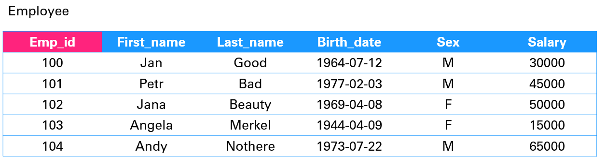

# Database basics | SQL

### Presentation

### Data types
* INT - integer - numbers
* VARCHAR - string - text
* DATETIME - date + time
* ...

### Options
* PRIMARY KEY
* FOREIGN KEY
* NOT NULL
* UNIQUE
* DEFAULT
* IDENTITY(1,1)
* ...1

### Creating database

```SQL

CREATE DATABASE name;

```

### Creating table

```SQL
CREATE TABLE name (
  column_name TYPE OPTIONS,
  ....
);

```

### Delete the table 

```SQL

DROP TABLE name;

```

### Modify table

```SQL

ALTER TABLE name ADD column_name TYPE OPTIONS;

```

### Insert data
```SQL

INSERT INTO table_name (column1, column2, column3, ...)
VALUES (value1, value2, value3, ...);

```

Inserting value for every column we can do just
```SQL

INSERT INTO table_name
VALUES (value1, value2, value3, ...);

```

Multiple rows in one query 
```SQL

INSERT INTO table_name (column_list)
VALUES
    (value_list_1),
    (value_list_2),
    ...
    (value_list_n);
```

### Exercise:

1. Create this table and fill it with data



(100, 'Jan', 'Good', '1964-07-12', 'M', 30000),
(101, 'Petr', 'Bad', '1977-02-03', 'M', 45000),
(102, 'Jana', 'Beauty', '1969-04-08', 'F', 50000),
(103, 'Angela', 'Merkel', '1944-04-009', 'F', 15000),
(104, 'Andy', 'Nothere', '1973-07-22', 'M', 65000),

2. Add one more row with custom data where you do not state the salary (use first type of INSERT)
	
<details><summary markdown="span">Click to see the solution!</summary>

```SQL

CREATE TABLE Employee (
	emp_id INT PRIMARY KEY,
	first_name VARCHAR(25),
	last_name VARCHAR(25),
	birth_date DATE,
	sex VARCHAR(1),
	salary INT
);

INSERT INTO Employee VALUES
(100, 'Jan', 'Good', '1964-07-12', 'M', 30000),
(101, 'Petr', 'Bad', '1977-02-03', 'M', 45000),
(102, 'Jana', 'Beauty', '1969-04-08', 'F', 50000),
(103, 'Angela', 'Merkel', '1944-04-09', 'F', 15000),
(104, 'Andy', 'Nothere', '1973-07-22', 'M', 65000);

INSERT INTO Employee(emp_id, first_name, last_name, birth_date, sex)
VALUES(105, 'Andy', 'Nothere', '1973-07-22', 'M');

```

</details>

### Retrieve all data

```SQL

SELECT * FROM table_name;

```

### Harder exercise

1. Drop the table
2. Create it with auto increment emp_id - Identity(startId, incremental))
3. Insert values without id

<details><summary markdown="span">Click to see the solution!</summary>

```SQL

DROP TABLE Employee;

CREATE TABLE Employee (
	emp_id INT IDENTITY(100,1) PRIMARY KEY,
	first_name VARCHAR(25),
	last_name VARCHAR(25),
	birth_date DATE,
	sex VARCHAR(1),
	salary INT
);

INSERT INTO Employee(first_name, last_name, birth_date, sex, salary)  VALUES
('Jan', 'Good', '1964-07-12', 'M', 30000),
('Petr', 'Bad', '1977-02-03', 'M', 45000),
('Jana', 'Beauty', '1969-04-08', 'F', 50000),
('Angela', 'Merkel', '1944-04-09', 'F', 15000),
('Andy', 'Nothere', '1973-07-22', 'M', 65000);

```

</details

### Update data in table

```SQL

UPDATE table_name
SET column1 = value1, column2 = value2, ...
WHERE condition;

```

### Delete data in table

```SQL

DELETE FROM table_name WHERE condition;

```
