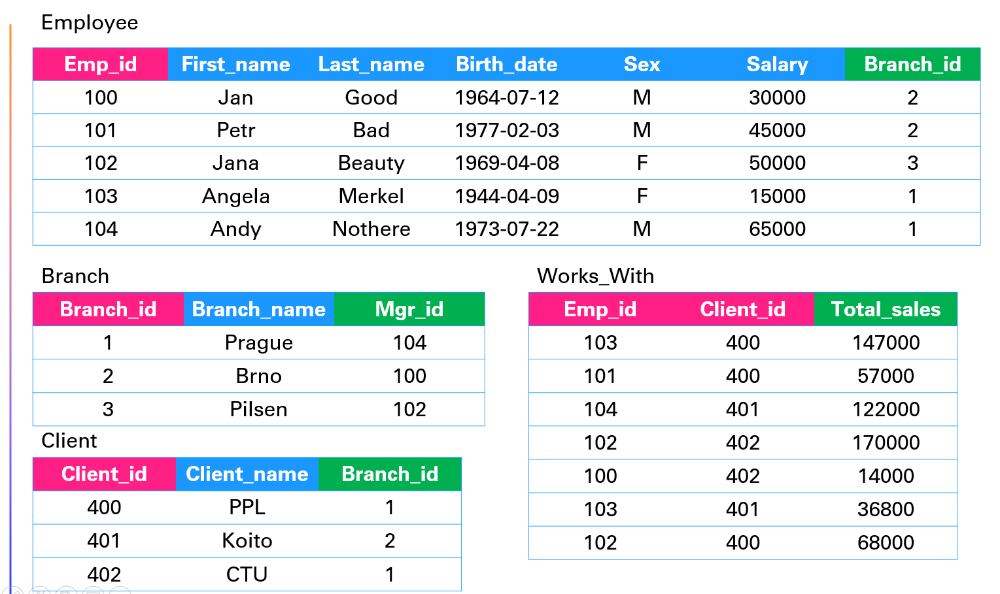

# Database basics | SQL

### Presentation
[Database_basics](Database_basics.pptx)

### Data types
* INT - integer - numbers
* VARCHAR - string - text
* DATETIME - date + time
* ...

### Options
* PRIMARY KEY
* FOREIGN KEY
* NOT NULL
* UNIQUE
* DEFAULT
* IDENTITY(1,1)
* ...1

### Creating database

```SQL

CREATE DATABASE name;

```

### Creating table

```SQL
CREATE TABLE name (
  column_name TYPE OPTIONS,
  ....
);

```

### Delete the table 

```SQL

DROP TABLE name;

```

### Modify table

```SQL

ALTER TABLE name ADD column_name TYPE OPTIONS;

```

### Insert data
```SQL

INSERT INTO table_name (column1, column2, column3, ...)
VALUES (value1, value2, value3, ...);

```

Inserting value for every column we can do just
```SQL

INSERT INTO table_name
VALUES (value1, value2, value3, ...);

```

Multiple rows in one query 
```SQL

INSERT INTO table_name (column_list)
VALUES
    (value_list_1),
    (value_list_2),
    ...
    (value_list_n);
```

### Exercise:

Create this table and fill it with data


(100, 'Jan', 'Good', '1964-07-12', 'M', 30000),
(101, 'Petr', 'Bad', '1977-02-03', 'M', 45000),
(102, 'Jana', 'Beauty', '1969-04-08', 'F', 50000),
(103, 'Angela', 'Merkel', '1944-04-009', 'F', 15000),
(104, 'Andy', 'Nothere', '1973-07-22', 'M', 65000),

Add one more row with custom data where you do not state the salary (use first type of INSERT)

<details><summary markdown="span">Click to see the solution!</summary>

```SQL

CREATE TABLE Employee (
	emp_id INT PRIMARY KEY,
	first_name VARCHAR(25),
	last_name VARCHAR(25),
	birth_date DATE,
	sex VARCHAR(1),
	salary INT
);

INSERT INTO Employee VALUES
(100, 'Jan', 'Good', '1964-07-12', 'M', 30000),
(101, 'Petr', 'Bad', '1977-02-03', 'M', 45000),
(102, 'Jana', 'Beauty', '1969-04-08', 'F', 50000),
(103, 'Angela', 'Merkel', '1944-04-09', 'F', 15000),
(104, 'Andy', 'Nothere', '1973-07-22', 'M', 65000);

INSERT INTO Employee(emp_id, first_name, last_name, birth_date, sex)
VALUES(105, 'Andy', 'Nothere', '1973-07-22', 'M');

```

</details>
<br/>

### Retrieve all data

```SQL

SELECT * FROM table_name;

```

### Harder exercise

1. Drop the table
2. Create it with auto increment emp_id - Identity(startId, incremental))
3. Insert values without id

<details><summary markdown="span">Click to see the solution!</summary>

```SQL

DROP TABLE Employee;

CREATE TABLE Employee (
	emp_id INT IDENTITY(100,1) PRIMARY KEY,
	first_name VARCHAR(25),
	last_name VARCHAR(25),
	birth_date DATE,
	sex VARCHAR(1),
	salary INT
);

INSERT INTO Employee(first_name, last_name, birth_date, sex, salary)  VALUES
('Jan', 'Good', '1964-07-12', 'M', 30000),
('Petr', 'Bad', '1977-02-03', 'M', 45000),
('Jana', 'Beauty', '1969-04-08', 'F', 50000),
('Angela', 'Merkel', '1944-04-09', 'F', 15000),
('Andy', 'Nothere', '1973-07-22', 'M', 65000);

```

</details>
<br/>


### Update data in table

```SQL

UPDATE table_name
SET column1 = value1, column2 = value2, ...
WHERE condition;

```

### Delete data in table

```SQL

DELETE FROM table_name WHERE condition;

```

## Retrieving data


```SQL

SELECT column_name FROM table_name
WHERE condition
OPTIONS

```

Example:

```SQL

SELECT first_name 
FROM Employee
ORDER BY emp_id ASC;

```

### Exercise:

Create all these tables 



HINT: 

```SQL

CREATE TABLE Branch (
  column_name INT,
  column_name ...
  ...
  PRIMARY KEY(column_name),
  FOREIGN KEY(mgr_id) REFERENCES employee(emp_id) ON DELETE SET NULL
);

ALTER TABLE employee
ADD FOREIGN KEY(branch_id)
REFERENCES branch(branch_id)
ON DELETE SET NULL;

```

<details><summary markdown="span">Click to see the solution!</summary>

```SQL

CREATE TABLE employee (
  emp_id INT PRIMARY KEY,
  first_name VARCHAR(40),
  last_name VARCHAR(40),
  birth_day DATE,
  sex VARCHAR(1),
  salary INT,
  branch_id INT
);

CREATE TABLE branch (
  branch_id INT PRIMARY KEY,
  branch_name VARCHAR(40),
  mgr_id INT,
  FOREIGN KEY(mgr_id) REFERENCES employee(emp_id) ON DELETE SET NULL
);

ALTER TABLE employee
ADD FOREIGN KEY(branch_id)
REFERENCES branch(branch_id)
ON DELETE SET NULL;

CREATE TABLE client (
  client_id INT PRIMARY KEY,
  client_name VARCHAR(40),
  branch_id INT,
  FOREIGN KEY(branch_id) REFERENCES branch(branch_id) ON DELETE SET NULL
);

CREATE TABLE works_with (
  emp_id INT,
  client_id INT,
  total_sales INT,
  PRIMARY KEY(emp_id, client_id),
  FOREIGN KEY(emp_id) REFERENCES employee(emp_id) ON DELETE CASCADE,
  FOREIGN KEY(client_id) REFERENCES client(client_id) ON DELETE CASCADE
);

```

</details>
<br/>

<details><summary markdown="span">Fill in the data</summary>

```SQL

INSERT INTO Employee VALUES
(100, 'Jan', 'Good', '1964-07-12', 'M', 30000, NULL),
(102, 'Jana', 'Beauty', '1969-04-08', 'F', 50000, NULL),
(104, 'Andy', 'Nothere', '1973-07-22', 'M', 65000, NULL);

INSERT INTO Branch VALUES
(1, 'Prague',  104),
(2, 'Brno',  100),
(3, 'Pilsen',  102);

UPDATE employee
SET branch_id = 1
WHERE emp_id = 104; 

UPDATE employee
SET branch_id = 2
WHERE emp_id = 100;

UPDATE employee
SET branch_id = 3
WHERE emp_id = 102;

INSERT INTO Employee VALUES
(101, 'Jan', 'Good', '1964-07-12', 'M', 30000, 2),
(103, 'Jana', 'Beauty', '1969-04-08', 'F', 50000, 1);

INSERT INTO Client VALUES
(400, 'PPL',  1),
(401, 'Koito', 2),
(402, 'CTU',  3);

INSERT INTO Works_with VALUES
(103, 400,  147000),
(101, 400, 57000),
(104, 401, 122000),
(102, 402, 170000),
(100, 402, 14000),
(103, 401, 36800),
(102, 400,  68000);

```

</details>
<br/>


## Functions

```SQL

SELECT COUNT(column_name)
FROM table_name
WHERE condition

SELECT AVG(salary)
FROM employee
WHERE sex = 'M';

SELECT SUM(salary)
FROM employee;

SELECT COUNT(sex), sex
FROM employee
GROUP BY sex;

```

### Final exercise

Retrieve a sum of all sales for all employee ids

<details><summary markdown="span">Fill in the data</summary>

```SQL

SELECT SUM(total_sales), emp_id
FROM works_with
GROUP BY emp_id;

```

</details>
<br/>


